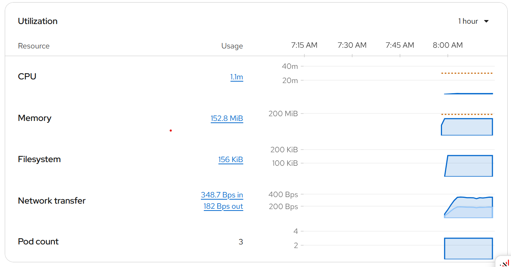

## DevOps Tutorial

This project deploys a simple httpd server to a Kubernetes cluster managed by OpenShift. It contains the following Kubernetes resources:

- Deployment
- Service
- Ingress
- Secret

The httpd server is generated from a RedHeat image. This specific image is necessary since OpenShift runs containers with a random user (non-root) in a read-only filesystem. Most images available in Docker Hub have the exact opposite setup: a root user running in a read-write filesystem. For this reason, the project uses the RedHat image.

This image adds a dummy index.hml as the front page and is then saved to DockerHub.

Both the deployment of the Kubernetes cluster and the update of the image in Docker Hub are done via a GitHub action, that in the first step ("CI") updates the image, and in the second updates the cluster ("CD") with the image and any other update done to the cluster configuration or html page. Later on, the action run another job to test the deployment. The gets the URL of Kubernetes Ingress, downloads the HTML and compares it with the html of the project.


### Kubernetes "Ingress"

OpenShift provides its own ingress concept called "Route". It is the default and recommended way of exposing your cluster for HTTP requests.


### Kubernetes Secret

The secret stores the Service Account token for OpenShift. First, it is necessary to create a User Account:

```bash
  oc create serviceaccount github-bot
```

Next, you will need to give permissions for the new account to the project:
```bash
  oc adm policy add-role-to-user edit -z github-bot -n PROJECT_NAME
```

Later on, you can use the `secret-template.yaml` to create the secret for OpenShift and get it:

```bash
oc apply -f k8s/secret-template.yaml
oc get secret github-bot-sa-token -o jsonpath='{.data.token}' | base64 -d
```

Save this as a secret (e.g., OPENSHIFT_TOKEN) in the GitHub repository and it can then be used in the Github action. 

## Monitoring and Alarming

Most cloud providers offers out-of-the-box dashboard to visualize resource usages. For Example, OpenShifts has an overview of resource usage in the home page of the project:



These cloud providers also offer an alarming solution when certain threhsolds were hit. Alternatively, one could use an Open Source Solution such as [Prometheus](https://prometheus.io/) for monitoring the Kubernetes cluster and its [Alertmanager](https://prometheus.io/docs/alerting/latest/alertmanager/) for alarming
